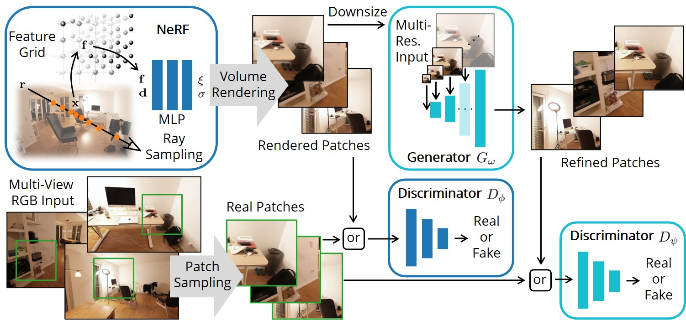

# GANeRF: Leveraging Discriminators to Optimize Neural Radiance Fields
SIGGRAPH Asia 2023

[Arxiv](https://arxiv.org/abs/2306.06044) | [Video](https://youtu.be/352ccXWxQVE) | [Project Page](https://barbararoessle.github.io/ganerf/)



## Environment Setup
Follow the [nerfstudio instuctions](https://github.com/nerfstudio-project/nerfstudio) upto and including the pytorch and tiny-cuda-nn installation. 
Then clone this repository and install: 
```
git clone https://github.com/barbararoessle/ganerf.git
cd ganerf
python -m pip install --upgrade pip setuptools
python -m pip install -e .
```

## Dataset
Download the ScanNet++ dataset following the [instructions](https://kaldir.vc.in.tum.de/scannetpp/). It is sufficient to download only the DSLR data. 

## Preprocessing
We undistort and downsize the images: 
```
python scripts/undistort_scannetpp.py \
--input_dir <directory to ScanNet++> \
--output_dir <directory for undistorted ScanNet++ scenes> \
--scene 2e74812d00
``` 
If no scene is specified, all scenes will be converted. We continue the commands in this README for the scene 2e74812d00. 

## Training Stage 1
The 1st training stage does a NeRF optimization with discriminator ([paper](https://arxiv.org/pdf/2306.06044.pdf) section 3.2). 
```
ns-train ganerf \
--output-dir <directory for writing results and checkpoints> \
--data <directory of undistorted ScanNet++ scenes>/2e74812d00 \
--pipeline.model.far-plane 4 \
scannetpp-data
```
As in nerfstudio, each experiment is logged into a subdirectory named with the starting time in the format `jjjj-mm-dd_hhmmss`, to which we refer as experiment name in the following. 

## Training Stage 2
The 2nd training stage trains a conditional generator ([paper](https://arxiv.org/pdf/2306.06044.pdf) section 3.3). 
First, the generator training is prepared by rendering all train and test views with the checkpoint from stage 1. The renderings, together with the ground truth images, are written to `<experiment name>/generator_dataset_<iteration>` to form the dataset for generator training. 
```
python scripts/prepare_generator_training.py \
--output_dir <directory for writing results and checkpoints> \
--scene 2e74812d00 \
--exp_name <experiment name>
```
Then, the generator training is started. 
```
python scripts/train_generator.py \
--output_dir <directory for writing results and checkpoints> \
--scene 2e74812d00 \
--exp_name <experiment name>
```
Test renderings, metrics and checkpoints are written to `<experiment name>/generator`. 

## Video
Finally, a video can be rendered as follows: 
```
ns-render camera-path \
--load-config <directory for writing results and checkpoints>/2e74812d00/ganerf/<experiment name>/config.yml \
--load-step 200000 \
--output_format images \
--camera-path-filename <path to ganerf repository clone>/assets/2e74812d00/30fps.json \
--output-path <directory for writing results and checkpoints>/2e74812d00/ganerf/<experiment name>/30fps.mp4 \
--run_generator True \
--load_original_intrinsics True \
--aspect_ratio_9_16 True
```

## Citation
If you find this repository useful, please cite:
```
@article{roessle2023ganerf,
        title={GANeRF: Leveraging Discriminators to Optimize Neural Radiance Fields}, 
        author={Roessle, Barbara and M{\"u}ller, Norman and Porzi, Lorenzo and Bul{\`o}, Samuel Rota and Kontschieder, Peter and Nie{\ss}ner, Matthias},
        year = {2023},
        issue_date = {December 2023},
        publisher = {Association for Computing Machinery},
        address = {New York, NY, USA},
        volume = {42},
        number = {6},
        issn = {0730-0301},
        url = {https://doi.org/10.1145/3618402},
        doi = {10.1145/3618402},
        journal = {ACM Trans. Graph.},
        month = {nov},
        articleno = {207},
        numpages = {14},
}
```

## Acknowledgements
We thank [nerfstudio](https://github.com/nerfstudio-project/nerfstudio) and [stylegan2-ada-pytorch](https://github.com/NVlabs/stylegan2-ada-pytorch), from which this repository borrows code.
